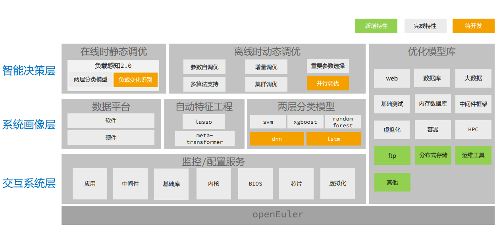
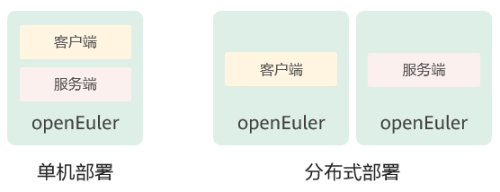

# A-Tune用户指南

[English](./A-Tune-User-Guide.md) | 简体中文

## 法律申明

**版权所有 © 2020** **华为技术有限公司。**

您对“本文档”的复制，使用，修改及分发受知识共享(Creative Commons)署名—相同方式共享4.0国际公共许可协议(以下简称“CC BY-SA 4.0”)的约束。为了方便用户理解，您可以通过访问https://creativecommons.org/licenses/by-sa/4.0/ 了解CC BY-SA 4.0的概要 (但不是替代)。CC BY-SA 4.0的完整协议内容您可以访问如下网址获取：https://creativecommons.org/licenses/by-sa/4.0/legalcode。

**商标声明**

A-Tune、openEuler为华为技术有限公司的商标。本文档提及的其他所有商标或注册商标，由各自的所有人拥有。

**免责声明**

本文档仅作为使用指导，除非适用法强制规定或者双方有明确书面约定, 华为技术有限公司对本文档中的所有陈述、信息和建议不做任何明示或默示的声明或保证，包括但不限于不侵权，时效性或满足特定目的的担保。

## 前言

### 概述

本文档介绍openEuler系统性能自优化软件A-Tune的安装部署和使用方法，以指导用户快速了解并使用A-Tune。

### 读者对象

本文档适用于使用openEuler系统并希望了解和使用A-Tune的社区开发者、开源爱好者以及相关合作伙伴。使用人员需要具备基本的Linux操作系统知识。

# 1 认识A-Tune

## 1.1 简介

操作系统作为衔接应用和硬件的基础软件，如何调整系统和应用配置，充分发挥软硬件能力，从而使业务性能达到最优，对用户至关重要。然而，运行在操作系统上的业务类型成百上千，应用形态千差万别，对资源的要求各不相同。当前硬件和基础软件组成的应用环境涉及高达7000多个配置对象，随着业务复杂度和调优对象的增加，调优所需的时间成本呈指数级增长，导致调优效率急剧下降，调优成为了一项极其复杂的工程，给用户带来巨大挑战。

其次，操作系统作为基础设施软件，提供了大量的软硬件管理能力，每种能力适用场景不尽相同，并非对所有的应用场景都通用有益，因此，不同的场景需要开启或关闭不同的能力，组合使用系统提供的各种能力，才能发挥应用程序的最佳性能。

另外，实际业务场景成千上万，计算、网络、存储等硬件配置也层出不穷，实验室无法遍历穷举所有的应用和业务场景，以及不同的硬件组合。

为了应对上述挑战，openEuler推出了A-Tune。

A-Tune是一款基于AI开发的系统性能优化引擎，它利用人工智能技术，对业务场景建立精准的系统画像，感知并推理出业务特征，进而做出智能决策，匹配并推荐最佳的系统参数配置组合，使业务处于最佳运行状态。


## 1.1 架构

A-Tune核心技术架构如下图，主要包括智能决策、系统画像和交互系统三层。

- 智能决策层：包含感知和决策两个子系统，分别完成对应用的智能感知和对系统的调优决策。

- 系统画像层：主要包括自动特征工程和两层分类模型，自动特征工程用于业务特征的自动选择，两层分类模型用于业务模型的学习和分类。

- 交互系统层：用于各类系统资源的监控和配置，调优策略执行在本层进行。



## 1.2 支持特性与业务模型

- 支持特性

A-Tune支持的主要特性、特性成熟度以及使用建议请参见表1-1。

表1-1 特性成熟度

| **特性**                       | **成熟度** | **使用建议** |
| ------------------------------ | ---------- | ------------ |
| 11大类15款应用负载类型自动优化 | 已测试     | 试用         |
| 自定义profile和业务模型        | 已测试     | 试用         |
| 参数自调优                     | 已测试     | 试用         |

- 支持业务模型

根据应用的负载特征，A-Tune将业务分为11大类，各类型的瓶颈点和A-Tune支持的应用请参见表1-2。

表1-2 支持的业务类型和应用

| **业务大类**       | **业务类型** | **瓶颈点**                                 | **支持的应用**                      |
| ------------------ | ------------ | ------------------------------------------ | ----------------------------------- |
| default            | 默认类型     | 算力、内存、网络、IO各维度资源使用率都不高 | N/A                                 |
| webserver          | web应用      | 算力瓶颈、网络瓶颈                         | Nginx、Apache Traffic Server        |
| database           | 数据库       | 算力瓶颈、内存瓶颈、IO瓶颈                 | Mongodb、Mysql、Postgresql、Mariadb |
| big-data           | 大数据       | 算力瓶颈、内存瓶颈                         | Hadoop-hdfs、Hadoop-spark           |
| middleware         | 中间件框架   | 算力瓶颈、网络瓶颈                         | Dubbo                               |
| in-memory-database | 内存数据库   | 内存瓶颈、IO瓶颈                           | Redis                               |
| basic-test-suite   | 基础测试套   | 算力瓶颈、内存瓶颈                         | SPECCPU2006、SPECjbb2015            |
| hpc                | 人类基因组   | 算力瓶颈、内存瓶颈、IO瓶颈                 | Gatk4                               |
| storage            | 存储         | 网络瓶颈、IO瓶颈                           | Ceph                                |
| virtualization     | 虚拟化       | 算力瓶颈、内存瓶颈、IO瓶颈                 | Consumer-cloud、Mariadb             |
| docker             | 容器         | 算力瓶颈、内存瓶颈、IO瓶颈                 | Mariadb                             |


# 2 安装与部署

本章介绍如何安装和部署A-Tune。

## 2.1 软硬件要求

**硬件要求**

- 鲲鹏920处理器

**软件要求**

- 操作系统：openEuler 20.03 LTS

## 2.2 环境准备

安装openEuler系统，安装方法参考《openEuler 20.03 LTS 安装指南》。

## 2.3 安装A-Tune

本章介绍A-Tune的安装模式和安装方法。

### 2.3.1 安装模式介绍

A-Tune支持单机模式和分布式模式安装：

- 单机模式

  client和server安装到同一台机器上。

- 分布式模式

  client和server分别安装在不同的机器上。

两种安装模式的简单图示如下：



### 2.3.2 安装操作

安装A-Tune的操作步骤如下：

**步骤 1**   挂载openEuler的iso文件。

```shell
# mount openEuler-20.03-LTS-aarch64-dvd.iso /mnt
```

**步骤 2**   配置本地yum源。

```shell
# vim /etc/yum.repos.d/local.repo
```

配置内容如下所示：

```shell
[local] 
name=local 
baseurl=file:///mnt 
gpgcheck=1 
enabled=1
```

**步骤 3**   导入公钥。

```shell
rpm --import /mnt/RPM-GPG-KEY-openEuler
```

**步骤 4**   安装A-Tune服务端。

> 
>
> 本步骤会同时安装服务端和客户端软件包，对于单机部署模式，请跳过**步骤5**。

```shell
# yum install atune -y
# yum install atune-engine -y
```

**步骤 5**   若为分布式部署，请在相关服务器上安装A-Tune客户端。

```shell
# yum install atune-client -y
```

**步骤 6**   验证是否安装成功。

```shell
# rpm -qa | grep atune 
 atune-client-xxx 
 atune-db-xxx 
 atune-xxx
 atune-engine-xxx
```

有如上回显信息表示安装成功。

----结束

## 2.4 部署A-Tune

本章介绍A-Tune的配置部署。

### 2.4.1 配置介绍

A-Tune配置文件/etc/atuned/atuned.cnf的配置项说明如下：

**A-Tune服务启动配置**

可根据需要进行修改。

- protocol：系统grpc服务使用的协议，unix或tcp，unix为本地socket通信方式，tcp为socket监听端口方式。默认为unix。
- address：系统grpc服务的侦听地址，默认为unix socket，若为分布式部署，需修改为侦听的ip地址。
- port：系统grpc服务的侦听端口，范围为0~65535未使用的端口。如果protocol配置是unix，则不需要配置。
- connect：若为集群部署时，atune所在节点的ip列表，ip地址以逗号分隔。
- rest_host：系统rest service的侦听地址，默认为localhost。
- rest_port：系统rest service的侦听端口, 范围为0~65535未使用的端口，默认为8383。
- engine_host：与系统atune engine service链接的地址。
- engine_port：与系统atune engine service链接的端口。
- sample_num：系统执行analysis流程时采集样本的数量，默认为20。
- interval：系统执行analysis流程时采集样本的间隔时间，默认为5s。
- grpc_tls：系统grpc的SSL/TLS证书校验开关，默认不开启。开启grpc_tls后，atune-adm命令在使用前需要设置以下环境变量方可与服务端进行通讯：
  - export ATUNE_TLS=yes
  - export ATUNED_CACERT=<客户端CA证书路径>
  - export ATUNED_CLIENTCERT=<客户端证书路径>
  - export ATUNED_CLIENTKEY=<客户端秘钥路径>
  - export ATUNED_SERVERCN=server
- tlsservercafile：gPRC服务端CA证书路径。
- tlsservercertfile：gPRC服务端证书路径。
- tlsserverkeyfile：gPRC服务端秘钥路径。
- rest_tls：系统rest service的SSL/TLS证书校验开关，默认开启。
- tlsrestcacertfile：系统rest service的服务端CA证书路径。
- tlsrestservercertfile：系统rest service的服务端证书路径
- tlsrestserverkeyfile：系统rest service的服务端秘钥路径。
- engine_tls：系统atune engine service的SSL/TLS证书校验开关，默认开启。
- tlsenginecacertfile：系统atune engine service的客户端CA证书路径。
- tlsengineclientcertfile：系统atune engine service的客户端证书路径
- tlsengineclientkeyfile：系统atune engine service的客户端秘钥路径。

**system信息**

system为系统执行相关的优化需要用到的参数信息，必须根据系统实际情况进行修改。

- disk：执行analysis流程时需要采集的对应磁盘的信息或执行磁盘相关优化时需要指定的磁盘。

- network：执行analysis时需要采集的对应的网卡的信息或执行网卡相关优化时需要指定的网卡。

- user：执行ulimit相关优化时用到的用户名。目前只支持root用户。


**日志信息**

根据情况修改日志的级别，默认为info级别，日志信息打印在/var/log/messages中。

**monitor信息**

为系统启动时默认采集的系统硬件信息。

**tuning信息**

tuning为系统进行离线调优时需要用到的参数信息。

- noise：高斯噪声的评估值。

- sel_feature：控制离线调优参数重要性排名输出的开关，默认关闭。

**配置示例**

```shell
#################################### server ############################### 
 # atuned config 
 [server] 
 # the protocol grpc server running on 
 # ranges: unix or tcp 
 protocol = unix 

 # the address that the grpc server to bind to
 # default is unix socket /var/run/atuned/atuned.sock
 # ranges: /var/run/atuned/atuned.sock or ip address
 address = /var/run/atuned/atuned.sock 

 # the atune nodes in cluster mode, separated by commas
 # it is valid when protocol is tcp
 # connect = ip01,ip02,ip03

 # the atuned grpc listening port
 # the port can be set between 0 to 65535 which not be used
 # port = 60001

 # the rest service listening port, default is 8383
 # the port can be set between 0 to 65535 which not be used
 rest_host = localhost
 rest_port = 8383

 # the tuning optimizer host and port, start by engine.service
 # if engine_host is same as rest_host, two ports cannot be same
 # the port can be set between 0 to 65535 which not be used
 engine_host = localhost
 engine_port = 3838

 # when run analysis command, the numbers of collected data.
 # default is 20
 sample_num = 20

 # interval for collecting data, default is 5s
 interval = 5

 # enable gRPC authentication SSL/TLS
 # default is false
 # grpc_tls = false
 # tlsservercafile = /etc/atuned/grpc_certs/ca.crt
 # tlsservercertfile = /etc/atuned/grpc_certs/server.crt
 # tlsserverkeyfile = /etc/atuned/grpc_certs/server.key

 # enable rest server authentication SSL/TLS
 # default is true
 rest_tls = true
 tlsrestcacertfile = /etc/atuned/rest_certs/ca.crt
 tlsrestservercertfile = /etc/atuned/rest_certs/server.crt
 tlsrestserverkeyfile = /etc/atuned/rest_certs/server.key

 # enable engine server authentication SSL/TLS
 # default is true
 engine_tls = true
 tlsenginecacertfile = /etc/atuned/engine_certs/ca.crt
 tlsengineclientcertfile = /etc/atuned/engine_certs/client.crt
 tlsengineclientkeyfile = /etc/atuned/engine_certs/client.key


 #################################### log ############################### 
 [log]
 # either "debug", "info", "warn", "error", "critical", default is "info"
 level = info

 #################################### monitor ############################### 
 [monitor]
 # with the module and format of the MPI, the format is {module}_{purpose}
 # the module is Either "mem", "net", "cpu", "storage"
 # the purpose is "topo"
 module = mem_topo, cpu_topo

 #################################### system ############################### 
 # you can add arbitrary key-value here, just like key = value
 # you can use the key in the profile
 [system]
 # the disk to be analysis
 disk = sda

 # the network to be analysis
 network = enp189s0f0

 user = root
 
 #################################### tuning ###############################
 # tuning configs
 [tuning]
 noise = 0.000000001
 sel_feature = false
```

A-Tune engine配置文件/etc/atuned/engine.cnf的配置项说明如下：

**A-Tune engine服务启动配置**

可根据需要进行修改。

- engine_host：系统atune engine service的侦听地址，默认为localhost。
- engine_port：系统atune engine service的侦听端口，范围为0~65535未使用的端口，默认为3838。
- engine_tls：系统atune engine service的SSL/TLS证书校验开关，默认开启。
- tlsenginecacertfile：系统atune engine service的服务端CA证书路径。
- tlsengineservercertfile：系统atune engine service的服务端证书路径
- tlsengineserverkeyfile：系统atune engine service的服务端秘钥路径。

**日志信息**

根据情况修改日志的级别，默认为info级别，日志信息打印在/var/log/messages中。

**配置示例**

```shell
 #################################### engine ###############################
 [server]
 # the tuning optimizer host and port, start by engine.service
 # if engine_host is same as rest_host, two ports cannot be same
 # the port can be set between 0 to 65535 which not be used
 engine_host = localhost
 engine_port = 3838

 # enable engine server authentication SSL/TLS
 # default is true
 engine_tls = true
 tlsenginecacertfile = /etc/atuned/engine_certs/ca.crt
 tlsengineservercertfile = /etc/atuned/engine_certs/server.crt
 tlsengineserverkeyfile = /etc/atuned/engine_certs/server.key

 #################################### log ###############################
 [log]
 # either "debug", "info", "warn", "error", "critical", default is "info"
 level = info
```

## 2.5 启动A-Tune

A-Tune安装完成后，需要启动A-Tune服务才能使用。

- 启动atuned服务：

  ```shell
  # systemctl start atuned
  ```

- 查询atuned服务状态：

  ```shell
  # systemctl status atuned
  ```

若回显为如下，则服务启动成功。


## 2.6 启动A-Tune engine

若需要使用AI相关的功能，需要启动A-Tune engine服务才能使用。

- 启动atune-engine服务：

  ```shell
  # systemctl start atune-engine
  ```

- 查询atune-engine服务状态：

  ```shell
  # systemctl status atune-engine
  ```

若回显为如下，则服务启动成功。


# 3 使用方法

用户可以通过命令行客户端atune-adm使用A-Tune提供的功能。本章介绍A-Tune客户端包含的功能和使用方法。

## 3.1 总体说明

- atune-adm支持的命令可以通过 **atune-adm help/--help/-h** 查询。

- 使用方法中所有命令的使用举例都是在单机部署模式下，如果是在分布式部署模式下，需要指定服务器IP和端口号，例如：

  ```shell
  # atune-adm -a 192.168.3.196 -p 60001 list
  ```

- define、update、undefine、collection、train、upgrade不支持远程执行。

- 命令格式中，[ ] 表示参数可选，<> 表示参数必选，具体参数由实际情况确定。


## 3.2 查询负载类型

### 3.2.1 list

**功能描述**

查询系统当前支持的profile，以及当前处于active状态的profile。

**命令格式**

**atune-adm list**

**使用示例**

```shell
# atune-adm list 

Support profiles:
+---------------------------------------------+-----------+
| ProfileName                                 | Active    |
+=============================================+===========+
| arm-native-android-container-robox          | false     |
+---------------------------------------------+-----------+
| basic-test-suite-baseline-fio               | false     |
+---------------------------------------------+-----------+
| basic-test-suite-baseline-lmbench           | false     |
+---------------------------------------------+-----------+
| basic-test-suite-baseline-netperf           | false     |
+---------------------------------------------+-----------+
| basic-test-suite-baseline-stream            | false     |
+---------------------------------------------+-----------+
| basic-test-suite-baseline-unixbench         | false     |
+---------------------------------------------+-----------+
| basic-test-suite-speccpu-speccpu2006        | false     |
+---------------------------------------------+-----------+
| basic-test-suite-specjbb-specjbb2015        | false     |
+---------------------------------------------+-----------+
| big-data-hadoop-hdfs-dfsio-hdd              | false     |
+---------------------------------------------+-----------+
| big-data-hadoop-hdfs-dfsio-ssd              | false     |
+---------------------------------------------+-----------+
| big-data-hadoop-spark-bayesian              | false     |
+---------------------------------------------+-----------+
| big-data-hadoop-spark-kmeans                | false     |
+---------------------------------------------+-----------+
| big-data-hadoop-spark-sql1                  | false     |
+---------------------------------------------+-----------+
| big-data-hadoop-spark-sql10                 | false     |
+---------------------------------------------+-----------+
| big-data-hadoop-spark-sql2                  | false     |
+---------------------------------------------+-----------+
| big-data-hadoop-spark-sql3                  | false     |
+---------------------------------------------+-----------+
| big-data-hadoop-spark-sql4                  | false     |
+---------------------------------------------+-----------+
| big-data-hadoop-spark-sql5                  | false     |
+---------------------------------------------+-----------+
| big-data-hadoop-spark-sql6                  | false     |
+---------------------------------------------+-----------+
| big-data-hadoop-spark-sql7                  | false     |
+---------------------------------------------+-----------+
| big-data-hadoop-spark-sql8                  | false     |
+---------------------------------------------+-----------+
| big-data-hadoop-spark-sql9                  | false     |
+---------------------------------------------+-----------+
| big-data-hadoop-spark-tersort               | false     |
+---------------------------------------------+-----------+
| big-data-hadoop-spark-wordcount             | false     |
+---------------------------------------------+-----------+
| cloud-compute-kvm-host                      | false     |
+---------------------------------------------+-----------+
| database-mariadb-2p-tpcc-c3                 | false     |
+---------------------------------------------+-----------+
| database-mariadb-4p-tpcc-c3                 | false     |
+---------------------------------------------+-----------+
| database-mongodb-2p-sysbench                | false     |
+---------------------------------------------+-----------+
| database-mysql-2p-sysbench-hdd              | false     |
+---------------------------------------------+-----------+
| database-mysql-2p-sysbench-ssd              | false     |
+---------------------------------------------+-----------+
| database-postgresql-2p-sysbench-hdd         | false     |
+---------------------------------------------+-----------+
| database-postgresql-2p-sysbench-ssd         | false     |
+---------------------------------------------+-----------+
| default-default                             | false     |
+---------------------------------------------+-----------+
| docker-mariadb-2p-tpcc-c3                   | false     |
+---------------------------------------------+-----------+
| docker-mariadb-4p-tpcc-c3                   | false     |
+---------------------------------------------+-----------+
| hpc-gatk4-human-genome                      | false     |
+---------------------------------------------+-----------+
| in-memory-database-redis-redis-benchmark    | false     |
+---------------------------------------------+-----------+
| middleware-dubbo-dubbo-benchmark            | false     |
+---------------------------------------------+-----------+
| storage-ceph-vdbench-hdd                    | false     |
+---------------------------------------------+-----------+
| storage-ceph-vdbench-ssd                    | false     |
+---------------------------------------------+-----------+
| virtualization-consumer-cloud-olc           | false     |
+---------------------------------------------+-----------+
| virtualization-mariadb-2p-tpcc-c3           | false     |
+---------------------------------------------+-----------+
| virtualization-mariadb-4p-tpcc-c3           | false     |
+---------------------------------------------+-----------+
| web-apache-traffic-server-spirent-pingpo    | false     |
+---------------------------------------------+-----------+
| web-nginx-http-long-connection              | false     |
+---------------------------------------------+-----------+
| web-nginx-http-short-connection             | false     |
+---------------------------------------------+-----------+
| web-nginx-https-long-connection             | false     |
+---------------------------------------------+-----------+
| web-nginx-https-short-connection            | false     |
+---------------------------------------------+-----------+
```

> 
>
> Active为true表示当前激活的profile，示例表示当前激活的profile是web-nginx-http-long-connection。

## 3.3 分析负载类型并自优化

### 3.3.1 analysis

**功能描述**

采集系统的实时统计数据进行负载类型识别，并进行自动优化。

**命令格式**

**atune-adm analysis** [OPTIONS]

**参数说明**

- OPTIONS

| 参数                   | 描述                                       |
| ---------------------- | ------------------------------------------ |
| --model, -m            | 用户自训练产生的新模型                     |
| --characterization, -c | 使用默认的模型进行应用识别，不进行自动优化 |

**使用示例**

- 使用默认的模型进行应用识别

  ```shell
  # atune-adm analysis --characterization
  ```

- 使用默认的模型进行应用识别，并进行自动优化

  ```shell
  # atune-adm analysis
  ```

- 使用自训练的模型进行应用识别

  ```shell
  # atune-adm analysis --model /usr/libexec/atuned/analysis/models/new-model.m
  ```

## 3.4 自定义模型

A-Tune支持用户定义并学习新模型。定义新模型的操作流程如下：

​                **步骤 1**   用define命令定义一个新应用的profile

​                **步骤 2**   用collection命令收集应用对应的系统数据

​                **步骤 3**   用train命令训练得到模型

----结束

### 3.4.1 define

**功能描述**

添加用户自定义的应用场景，及对应的profile优化项。

**命令格式**

**atune-adm define** <service_type> <application_name> <scenario_name> <profile_path>

**使用示例**

新增一个profile，service_type的名称为test_service，application_name的名称为test_app，scenario_name的名称为test_scenario，优化项的配置文件为example.conf。

```shell
# atune-adm define test_service test_app test_scenario ./example.conf
```

example.conf 可以参考如下方式书写（以下各优化项非必填，仅供参考），也可通过**atune-adm info**查看已有的profile是如何书写的。

```shell
 [main]
 # list its parent profile
 [kernel_config]
 # to change the kernel config
 [bios]
 # to change the bios config
 [bootloader.grub2]
 # to change the grub2 config
 [sysfs]
 # to change the /sys/* config
 [systemctl]
 # to change the system service status
 [sysctl]
 # to change the /proc/sys/* config
 [script]
 # the script extention of cpi
 [ulimit]
 # to change the resources limit of user
 [schedule_policy]
 # to change the schedule policy
 [check]
 # check the environment
 [tip]
 # the recommended optimization, which should be performed manunaly
```

### 3.4.2 collection

**功能描述**

采集业务运行时系统的全局资源使用情况以及OS的各项状态信息，并将收集的结果保存到csv格式的输出文件中，作为模型训练的输入数据集。

> 
>
> - 本命令依赖采样工具perf，mpstat，vmstat，iostat，sar。
>
> - CPU型号目前仅支持鲲鹏920，可通过dmidecode -t processor检查CPU型号。

**命令格式**

**atune-adm collection** <OPTINOS*>*

**参数说明**

- OPTIONS

| 参数              | 描述                                                 |
| ----------------- | ---------------------------------------------------- |
| --filename, -f    | 生成的用于训练的csv文件名：*名称**-**时间戳*.csv     |
| --output_path, -o | 生成的csv文件的存放路径，需提供绝对路径              |
| --disk, -b        | 业务运行时实际使用的磁盘，如/dev/sda                 |
| --network, -n     | 业务运行时使用的网络接口，如eth0                     |
| --app_type, -t    | 标记业务的应用类型，作为训练时使用的标签             |
| --duration, -d    | 业务运行时采集数据的时间，单位秒，默认采集时间1200秒 |
| --interval，-i    | 采集数据的时间间隔，单位秒，默认采集间隔5秒          |

**使用示例**

```shell
# atune-adm collection --filename name --interval 5 --duration 1200 --output_path /home/data --disk sda --network eth0 --app_type test_type 
```

### 3.4.3 train

**功能描述**

使用采集的数据进行模型的训练。训练时至少采集两种应用类型的数据，否则训练会出错。

**命令格式**

**atune-adm train** <OPTINOS*>*

**参数说明**

- OPTIONS

| 参数              | 描述                            |
| ----------------- | ------------------------------- |
| --data_path, -d   | 存放模型训练所需的csv文件的目录 |
| --output_file, -o | 训练生成的新模型                |

**使用示例**

使用data目录下的csv文件作为训练输入，生成的新模型new-model.m存放在model目录下。

```shell
# atune-adm train --data_path /home/data --output_file /usr/libexec/atuned/analysis/models/new-model.m 
```

### 3.4.4 undefine

**功能描述**

删除用户自定义的profile。

**命令格式**

**atune-adm undefine** <profile*>*

**使用示例**

删除自定义的profile。

```shell
# atune-adm undefine test_service-test_app-test_scenario
```


## 3.5 查询profile

### 3.5.1 info

**功能描述**

查看对应的profile内容。

**命令格式**

**atune-adm info** <profile*>*

**使用示例**

查看web-nginx-http-long-connection的profile内容：

```shell
# atune-adm info web-nginx-http-long-connection

*** web-nginx-http-long-connection:

#
# nginx http long connection A-Tune configuration
#
[main]
include = default-default

[kernel_config]
#TODO CONFIG

[bios]
#TODO CONFIG

[bootloader.grub2]
iommu.passthrough = 1

[sysfs]
#TODO CONFIG

[systemctl]
sysmonitor = stop
irqbalance = stop

[sysctl]
fs.file-max = 6553600
fs.suid_dumpable = 1
fs.aio-max-nr = 1048576
kernel.shmmax = 68719476736
kernel.shmall = 4294967296
kernel.shmmni = 4096
kernel.sem = 250 32000 100 128
net.ipv4.tcp_tw_reuse = 1
net.ipv4.tcp_syncookies = 1
net.ipv4.ip_local_port_range = 1024     65500
net.ipv4.tcp_max_tw_buckets = 5000
net.core.somaxconn = 65535
net.core.netdev_max_backlog = 262144
net.ipv4.tcp_max_orphans = 262144
net.ipv4.tcp_max_syn_backlog = 262144
net.ipv4.tcp_timestamps = 0
net.ipv4.tcp_synack_retries = 1
net.ipv4.tcp_syn_retries = 1
net.ipv4.tcp_fin_timeout = 1
net.ipv4.tcp_keepalive_time = 60
net.ipv4.tcp_mem =  362619      483495   725238
net.ipv4.tcp_rmem = 4096         87380   6291456
net.ipv4.tcp_wmem = 4096         16384   4194304
net.core.wmem_default = 8388608
net.core.rmem_default = 8388608
net.core.rmem_max = 16777216
net.core.wmem_max = 16777216

[script]
prefetch = off
ethtool =  -X {network} hfunc toeplitz

[ulimit]
{user}.hard.nofile = 102400
{user}.soft.nofile = 102400

[schedule_policy]
#TODO CONFIG

[check]
#TODO CONFIG

[tip]
SELinux provides extra control and security features to linux kernel. Disabling SELinux will improve the performance but may cause security risks. = kernel
disable the nginx log = application
```

## 3.6 更新profile

用户根据需要更新已有profile。

### 3.6.1 update

**功能描述**

将已有profile中原来的优化项更新为new.conf中的内容。

**命令格式**

**atune-adm update** <profile*>* <profile_path*>*

**使用示例**

更新名为test_service-test_app-test_scenario的profile优化项为new.conf。

```shell
# atune-adm update test_service-test_app-test_scenario ./new.conf
```

## 3.7 激活profile

### 3.7.1 profile

**功能描述**

手动激活profile，使其处于active状态。

**命令格式**

**atune-adm profile** *<*profile*>*

**参数说明**

profile名参考list命令查询结果。

**使用示例**

激活web-nginx-http-long-connection对应的profile配置。

```shell
# atune-adm profile web-nginx-http-long-connection
```

## 3.8 回滚profile

### 3.8.1 rollback

**功能描述**

回退当前的配置到系统的初始配置。

**命令格式**

**atune-adm rollback**

**使用示例**

```shell
# atune-adm rollback
```

## 3.9 更新数据库

### 3.9.1 upgrade

**功能描述**

更新系统的数据库。

**命令格式**

**atune-adm upgrade** <DB_FILE>

**参数说明**

- DB_FILE

  新的数据库文件路径

**使用示例**

数据库更新为new_sqlite.db。

```shell
# atune-adm upgrade ./new_sqlite.db
```

## 3.10 系统信息查询

### 3.10.1 check

**功能描述**

检查系统当前的cpu、bios、os、网卡等信息。

**命令格式**

**atune-adm check**

**使用示例**

```shell
# atune-adm check 
 cpu information: 
   cpu:0  version: Kunpeng 920-6426 speed: 2600000000 HZ  cores: 64 
   cpu:1  version: Kunpeng 920-6426 speed: 2600000000 HZ  cores: 64 
 system information: 
   DMIBIOSVersion: 0.59 
   OSRelease: ...
 network information: 
   name: eth0       product: HNS GE/10GE/25GE RDMA Network Controller 
   name: eth1       product: HNS GE/10GE/25GE Network Controller 
   name: eth2       product: HNS GE/10GE/25GE RDMA Network Controller 
   name: eth3       product: HNS GE/10GE/25GE Network Controller 
   name: eth4       product: HNS GE/10GE/25GE RDMA Network Controller 
   name: eth5       product: HNS GE/10GE/25GE Network Controller 
   name: eth6       product: HNS GE/10GE/25GE RDMA Network Controller 
   name: eth7       product: HNS GE/10GE/25GE Network Controller 
   name: docker0    product:
```

## 3.11 参数自调优

A-Tune提供了最佳配置的自动搜索能力，免去人工反复做参数调整、性能评价的调优过程，极大地提升最优配置的搜寻效率。

### 3.11.1 tuning

**功能描述**

使用指定的项目文件对参数进行动态空间的搜索，找到当前环境配置下的最优解。

**命令格式**

**atune-adm tuning** [OPTIONS] <PROJECT_YAML>

> 
>
> 在运行命令前，确保以下条件已经满足：
>
> - 服务端的yaml配置文件已经编辑完成并放置于 atuned服务下的**/etc/atuned/tuning/**目录中
>
> - 客户端的yaml配置文件已经编辑完成并放置于atuned客户端任意目录下

**参数说明**

- OPTIONS

| 参数          | 描述                               |
| ------------- | ---------------------------------- |
| --restore, -r | 恢复tuning优化前的初始配置         |
| --project, -p | 指定需要恢复的yaml文件中的项目名称 |
| --restart, -c | 基于历史调优结果进行调优           |
| --detail, -d  | 打印tuning过程的详细信息           |

 

> 
>
>  当使用参数时，-p参数后需要跟具体的项目名称且必须指定该项目yaml文件。

- PROJECT_YAML：客户端yaml配置文件。

**配置说明**

表3-1 服务端yaml文件

| **配置名称**  | **配置说明**                                                 | **参数类型** | **取值范围** |
| ------------- | ------------------------------------------------------------ | ------------ | ------------ |
| project       | 项目名称。                                                   | 字符串       | -            |
| startworkload | 待调优服务的启动脚本。                                       | 字符串       | -            |
| stopworkload  | 待调优服务的停止脚本。                                       | 字符串       | -            |
| maxiterations | 最大调优迭代次数，用于限制客户端的迭代次数。一般来说，调优迭代次数越多，优化效果越好，但所需时间越长。用户必须根据实际的业务场景进行配置。 | 整型         | >10          |
| object        | 需要调节的参数项及信息。  object 配置项请参见表3-2。         | -            | -            |

 

表3-2 object项配置说明

| **配置名称** | **配置说明**                                                 | **参数类型** | **取值范围**                       |
| ------------ | ------------------------------------------------------------ | ------------ | ---------------------------------- |
| name         | 待调参数名称                                                 | 字符串       | -                                  |
| desc         | 待调参数描述                                                 | 字符串       | -                                  |
| get          | 查询参数值的脚本                                             | -            | -                                  |
| set          | 设置参数值的脚本                                             | -            | -                                  |
| needrestart  | 参数生效是否需要重启业务                                     | 枚举         | "true", "false"                    |
| type         | 参数的类型，目前支持discrete,  continuous两种类型，对应离散型、连续型参数 | 枚举         | "discrete",  "continuous"          |
| dtype        | 该参数仅在type为discrete类型时配置，目前支持int, float, string类型 | 枚举         | int, float, string                 |
| scope        | 参数设置范围，仅在type为discrete且dtype为int或float时或者type为continuous时生效 | 整型/浮点型  | 用户自定义，取值在该参数的合法范围 |
| step         | 参数值步长，dtype为int或float时使用                          | 整型/浮点型  | 用户自定义                         |
| items        | 参数值在scope定义范围之外的枚举值，dtype为int或float时使用   | 整型/浮点型  | 用户自定义，取值在该参数的合法范围 |
| options      | 参数值的枚举范围，dtype为string时使用                        | 字符串       | 用户自定义，取值在该参数的合法范围 |

 

表3-3 客户端yaml文件配置说明

| **配置名称**          | **配置说明**                                                 | **参数类型** | **取值范围**                                      |
| --------------------- | ------------------------------------------------------------ | ------------ | ------------------------------------------------- |
| project               | 项目名称，需要与服务端对应配置文件中的project匹配            | 字符串       | -                                                 |
| engine                | 调优算法                                                     | 字符串       | "random", "forest", "gbrt", "bayes", "extraTrees" |
| iterations            | 调优迭代次数                                                 | 整型         | >= 10                                             |
| random_starts         | 随机迭代次数                                                 | 整型         | < iterations                                      |
| feature_filter_engine | 参数搜索算法，用于重要参数选择，该参数可选                   | 字符串       | "lhs"                                             |
| feature_filter_cycle  | 参数搜索轮数，用于重要参数选择，该参数配合feature_filter_engine使用 | 整型         | -                                                 |
| feature_filter_iters  | 每轮参数搜索的迭代次数，用于重要参数选择，该参数配合feature_filter_engine使用 | 整型         | -                                                 |
| split_count           | 调优参数取值范围中均匀选取的参数个数，用于重要参数选择，该参数配合feature_filter_engine使用 | 整型         | -                                                 |
| benchmark             | 性能测试脚本                                                 | -            | -                                                 |
| evaluations           | 性能测试评估指标  evaluations 配置项请参见表3-4              | -            | -                                                 |

 

表3-4 evaluations项配置说明

| **配置名称** | **配置说明**                                                 | **参数类型** | **取值范围**          |
| ------------ | ------------------------------------------------------------ | ------------ | --------------------- |
| name         | 评价指标名称                                                 | 字符串       | -                     |
| get          | 获取性能评估结果的脚本                                       | -            | -                     |
| type         | 评估结果的正负类型，positive代表最小化性能值，negative代表最大化对应性能值 | 枚举         | "positive","negative" |
| weight       | 该指标的权重百分比，0-100                                    | 整型         | 0-100                 |
| threshold    | 该指标的最低性能要求                                         | 整型         | 用户指定              |

 

**配置示例**

服务端yaml文件配置示例：

```yaml
project: "compress"
maxiterations: 500
startworkload: ""
stopworkload: ""
object :
  -
    name : "compressLevel"
    info :
        desc : "The compresslevel parameter is an integer from 1 to 9 controlling the level of compression"
        get : "cat /root/A-Tune/examples/tuning/compress/compress.py | grep 'compressLevel=' | awk -F '=' '{print $2}'"
        set : "sed -i 's/compressLevel=\\s*[0-9]*/compressLevel=$value/g' /root/A-Tune/examples/tuning/compress/compress.py"
        needrestart : "false"
        type : "continuous"
        scope :
          - 1
          - 9
        dtype : "int"
  -
    name : "compressMethod"
    info :
        desc : "The compressMethod parameter is a string controlling the compression method"
        get : "cat /root/A-Tune/examples/tuning/compress/compress.py | grep 'compressMethod=' | awk -F '=' '{print $2}' | sed 's/\"//g'"
        set : "sed -i 's/compressMethod=\\s*[0-9,a-z,\"]*/compressMethod=\"$value\"/g' /root/A-Tune/examples/tuning/compress/compress.py"
        needrestart : "false"
        type : "discrete"
        options :
          - "bz2"
          - "zlib"
          - "gzip"
        dtype : "string"
```

客户端yaml文件配置示例：

```yaml
project: "compress"
engine : "gbrt"
iterations : 20
random_starts : 10

benchmark : "python3 /root/A-Tune/examples/tuning/compress/compress.py"
evaluations :
  -
    name: "time"
    info:
        get: "echo '$out' | grep 'time' | awk '{print $3}'"
        type: "positive"
        weight: 20
  -
    name: "compress_ratio"
    info:
        get: "echo '$out' | grep 'compress_ratio' | awk '{print $3}'"
        type: "negative"
        weight: 80
```

**使用示例**

- 进行tuning调优

  ```shell
  # atune-adm tuning --project compress --detail compress_client.yaml
  ```

- 恢复tuning调优前的初始配置，compress为yaml文件中的项目名称

  ```shell
  # atune-adm tuning --restore --project compress
  ```


# 4 常见问题与解决方法

**问题1：train命令训练模型出错，提示“training data failed”。**

**原因：** collection命令只采集一种类型的数据。

**解决方法：** 至少采集两种数据类型的数据进行训练。

**问题2：atune-adm无法连接atuned服务。**

**可能原因：**

1. 检查atuned服务是否启动，并检查atuned侦听地址。

   ```shell
   # systemctl status atuned 
   # netstat -nap | atuned
   ```

2. 防火墙阻止了atuned的侦听端口。

3. 系统配置了http代理导致无法连接。

**解决方法：**

1. 如果atuned没有启动，启动该服务，参考命令如下：

   ```shell
   # systemctl start atuned
   ```

2. 分别在atuned和atune-adm的服务器上执行如下命令，允许侦听端口接收网络包，其中60001为atuned的侦听端口号。

   ```shell
   # iptables -I INPUT -p tcp --dport 60001 -j ACCEPT 
   # iptables -I INPUT -p tcp --sport 60001 -j ACCEPT
   ```

3. 不影响业务的前提下删除http代理，或对侦听IP不进行http代理，命令如下：

   ```shell
   # no_proxy=$no_proxy,侦听地址
   ```

**问题3：atuned服务无法启动，提示“Job for atuned.service failed because a timeout was exceeded.”。**

**原因：** hosts文件中缺少localhost配置

**解决方法：** 在/etc/hosts文件中127.0.0.1这一行添加上localhost

```
127.0.0.1 localhost localhost.localdomain localhost4 localhost4.localdomain4
```

# 5 附录

## 5.1 术语和缩略语

表5-1 术语表

| 术语    | 含义                       |
| ------- | -------------------------- |
| profile | 优化项集合，最佳的参数配置 |

 
